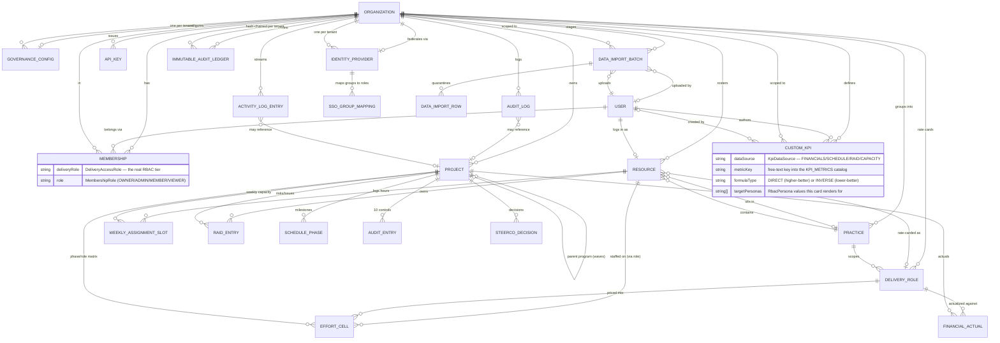

# Entity Relationship Diagram — A2R Delivery OS

Source of truth is always `prisma/schema.prisma`; this is a reader's map onto
it, current as of **v1.4.0** (Role-Based Scoped Filtering, the Custom KPI
Definition Engine, and the complete 4-pillar Batch Import Engine).
Regenerate/extend this doc whenever a schema change adds, removes, or
re-relates a model — it should never drift further than one release behind
`schema.prisma`.

Every tenant-scoped model carries an `organizationId` foreign key (row-level
multi-tenancy — see `src/lib/db/scoped-portfolio.ts` and
`tests/security/tenant-isolation.test.ts`); those edges are omitted below
where a more specific relationship already implies the tenant (e.g. a
`Project` belongs to an `Organization`, so everything hanging off `Project`
is transitively tenant-scoped without its own drawn edge).

## Core schema

## Domain notes

**Identity & access** — `User` is the login; `Membership` is the join row
that puts a `User` into an `Organization` with two *independent* role axes
(`MembershipRole` for tenant-console tier, `DeliveryAccessRole` for the real
delivery-portfolio RBAC enforced by `src/lib/auth/rbac.ts` and
`src/middleware.ts`). A `User` may also link to at most one `Resource` per
org (`Resource.userId`) — the roster/rate-card entry that person shows up as
in staffing, effort, and RAID ownership.

**Delivery spine** — `Project` is the hub every delivery module hangs off:
`EffortCell` (the Phase × Role baseline matrix), `FinancialActual` (realized
hours/cost per role or the `_direct` sentinel), `SchedulePhase` (one row per
delivery phase — status, % complete, actual dates), `RaidEntry`, `AuditEntry`
(the 10 Minimum Controls), `WeeklyAssignmentSlot` (the weekly capacity/actual
grain shared by the Capacity Cockpit and the Batch Import Engine below), and
`SteerCoDecision`.

**Governance & Identity Federation** — `GovernanceConfig` (one per tenant)
holds the Hybrid Configuration Model: a compliance `GovernanceTemplate` plus
Layer-2 overrides (`hiddenModules`, `maskFinancialsForDelivery`).
`IdentityProvider` (one per tenant) holds SAML/OIDC SSO config, with
`SsoGroupMapping` rows resolving a federated login's security group to a
`DeliveryAccessRole` on JIT provisioning.

**Governance integrity** — `AuditLog` is the general "what changed" trail
(baseline locks, EAC edits, CSV/batch imports, workspace restore);
`ImmutableAuditLedger` is the narrower, hash-chained SOC 2 ledger for the
highest-consequence actions only (tenant lifecycle, SSO config, batch import
**commits** — see `src/lib/audit-ledger.ts`'s `LedgerActionType` union).
`ActivityLogEntry` is the PS Control Tower's lightweight "recent activity"
feed — a third, deliberately separate trail from the two above.

**Self-Service Batch Import Engine (WP7)** — a `DataImportBatch` is one
staged upload (CSV or Excel; `BatchImportDataType` is one of four pillars —
`WEEKLY_ACTUALS`, `MILESTONE_PROGRESS`, `FORECAST_EAC`, or `STATUS_RAID`);
each `DataImportRow` holds that row's raw cell values plus its own
`BatchImportRowStatus` (`VALID`/`ERROR`/`CORRECTED`) and plain-English
`errors`. Nothing here writes to `WeeklyAssignmentSlot` / `SchedulePhase` /
`FinancialActual` / `ActivityLogEntry` / `RaidEntry` until
`commitImportBatch` re-validates every row one more time and, only if none
error, upserts them in a single transaction — see
`src/server/actions/data-import.ts` and `src/lib/ingestion/batch-schemas.ts`.
`FORECAST_EAC` targets matrix-mode projects only (`FinancialActual`, keyed
by `(projectId, roleKey)`); `STATUS_RAID` fans out to `ActivityLogEntry`
(narrative) and/or `RaidEntry` (a RAID item) per row.

**Custom KPI Definition Engine** — `CustomKpi` is a *binding*, not a stored
formula: an org-scoped row naming a data source, one metric from that
source's fixed catalog (`src/types/kpi.ts`'s `KPI_METRICS`), a target/warning
threshold pair, and the `targetPersonas` it renders for. There is no
expression language and no separate "KPI value" table — every value is
computed live off the same models above (`FinancialActual`, `SchedulePhase`,
`RaidEntry`, and the Capacity Cockpit's resource/assignment data) by
`src/server/queries/kpi-data.ts` at render time.

**Role-Based Scoped Filtering** — adds no new table. It is a query-time
predicate (`src/lib/scoping.ts`) applied to the existing `Project` and
`Resource` reads above: a global role (`ADMIN`, `VP_EXECUTIVE`) gets an
unfiltered `organizationId` where-clause; a practice-scoped role
(`PRACTICE_DIRECTOR` via `Resource.practiceId`, `DELIVERY_MANAGER` via
direct reports, `PROJECT_MANAGER` via own assignments) gets the same
where-clause narrowed by that identity, built once and shared between the
DB-free authorization check and the Prisma query so the two can't drift.

## Supporting entities (omitted from the diagram for legibility)

| Model | Purpose |
|---|---|
| `Account`, `Session`, `VerificationToken` | Auth.js/NextAuth adapter tables (OAuth plumbing; credentials login uses JWT sessions, not these). |
| `ImpersonationGrant` | The Impersonation Gateway's time-boxed, audited operator → tenant sessions. |
| `OrgPolicy` | Legacy per-tenant tolerances (slip/margin thresholds) predating `GovernanceConfig`. |
| `ControlLabel` | Per-tenant display-label override for a `CTRL_01..10` key (the labels are editable; the keys are frozen — see `docs/` control-audit nomenclature notes). |
| `ProjectContributor`, `ScopeItem` | Project-level contributor tagging and scope-item breakdown. |
| `OrganizationHoliday`, `RoleUtilizationPolicy` | Capacity & Concurrency inputs — holiday calendars and per-role utilization targets. |
| `TimesheetEntry` | Raw rows ingested via the Bearer-token `/api/v1` Data Ingestion API Bridge (machine-to-machine), rolled into `WeeklyAssignmentSlot`. Distinct from `DataImportBatch`, which is the human, browser-driven self-service path. |

## Diagram conventions

- `||--o{` = one-to-many (mandatory one side, optional many side); `}o--o|`
  = many-to-optional-one; `}o--||` = many-to-mandatory-one.
- Enum-typed fields are called out inline (e.g. `MembershipRole`,
  `BatchImportRowStatus`) rather than drawn as separate entities.
- Renders natively wherever GitHub or this repo's tooling renders Mermaid;
  paste the fenced block into any Mermaid live editor otherwise.
